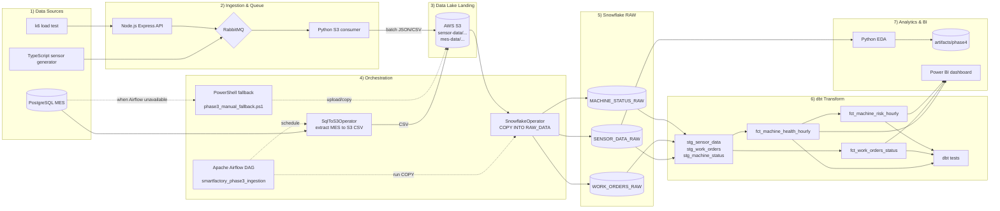

# Cloud-Native Smart Factory Data Lakehouse

Project status: Completed (Phase 4 portfolio-ready release)

This repository delivers an end-to-end smart factory data platform from ingestion to analytics dashboard:
- IoT sensor ingestion (HTTP and direct queue publisher)
- Message queue and batch landing to S3 data lake
- Snowflake RAW loading and transformation with dbt
- Feature engineering and risk scoring for machine health
- Power BI dashboard for operational decisions

## End-to-End Workflow

1. Data generation and ingestion
- Sensor Generator (TypeScript) publishes telemetry to RabbitMQ.
- API Server (Express) accepts POST /api/sensor-data and publishes to RabbitMQ.

2. Landing zone and storage
- Python consumer reads queue messages, batches by size/time, writes JSON or CSV, and uploads to S3 partition path.

3. Raw warehouse loading
- Snowflake RAW tables receive data from S3 stage via COPY INTO.
- MES data path (PostgreSQL -> S3 -> Snowflake) runs through Airflow DAG or manual fallback.

4. Transformation and quality checks
- dbt source declarations and staging models clean and normalize raw fields.
- dbt mart models build business views:
  - fct_machine_health_hourly
  - fct_work_orders_status
  - fct_machine_risk_hourly
- dbt tests validate not_null, unique, accepted_values, and risk score range.

5. Analytics and reporting
- Python EDA script computes correlations, rolling features, baselines, sustained breaches, and risk ranking outputs.
- Power BI dashboard consumes transformed Snowflake views and DAX measures for operational KPIs.

## Architecture Summary

Telemetry Source -> API/Generator -> RabbitMQ -> Python Consumer -> S3 -> Snowflake RAW -> dbt Staging/Marts -> Python EDA + Power BI

## Architecture Diagram (Mermaid)



Notes:
- API framework is Express (not Fastify) in current implementation.
- Airflow currently orchestrates extract/load into Snowflake RAW for Phase 3; dbt runs are managed separately.
- BI target in this repository is Power BI.

## Tech Stack and Purpose

### Data ingestion and application layer
- TypeScript + Node.js: Sensor publisher and ingestion API runtime
- Express: HTTP ingestion endpoints and simple dashboard endpoint
- amqplib: RabbitMQ publish/queue channel operations
- RabbitMQ: Message buffer/decoupling between producers and consumers

### Batch movement and cloud storage
- Python 3: S3 consumer and analytics scripts
- pika: RabbitMQ consumption in Python worker
- boto3: S3 upload and object operations
- AWS S3: Data lake landing zone and partitioned object storage

### Warehouse and transformations
- Snowflake: Central cloud warehouse (RAW and analytics schemas)
- dbt Cloud / dbt Core patterns: SQL transformation, lineage, testing, deployment jobs

### Analytics and BI
- pandas: Data shaping and feature construction
- matplotlib + seaborn: EDA charts and correlation visualization
- Power BI: KPI and operational dashboard consumption layer

### Orchestration and local runtime
- Apache Airflow (DAG assets): Orchestrated MES bridge flow
- Docker Compose: Local services for PostgreSQL and RabbitMQ
- PowerShell scripts: Operational fallback and environment setup utilities

### Performance and validation
- k6: API load testing and baseline SLO evaluation

## Repository Map

- src/: TypeScript API and sensor generator
- python/: Queue consumer and analytics scripts
- models/: dbt sources, staging, marts
- tests/: custom dbt tests
- sql/: Snowflake and PostgreSQL SQL assets
- airflow/: DAG and local Airflow compose
- docs/: runbooks, summaries, and final project documents
- k6/: load test scripts
- scripts/: fallback and environment helper scripts

## Quick Start (Core Components)

### 1) Start local infra

```powershell
docker compose up -d
```

### 2) Run API or sensor generator

```powershell
npm install
npm run dev:api
```

Or run direct generator:

```powershell
npm run dev:generator
```

### 3) Run Python S3 consumer

```powershell
.\.venv\Scripts\python.exe -m pip install -r .\python\requirements.txt
.\.venv\Scripts\python.exe .\python\s3_consumer.py
```

### 4) Build analytics marts (dbt)

```bash
dbt build --select fct_machine_health_hourly fct_machine_risk_hourly
dbt test --select fct_machine_risk_hourly
```

### 5) Run Phase 4 EDA package

```powershell
.\.venv\Scripts\python.exe -m pip install -r .\python\requirements-phase4.txt
.\.venv\Scripts\python.exe .\python\phase4_eda_template.py
```

## Key Documents

- Final completion and full lessons learned: docs/project-completion-report.md
- Final completion report (Thai): docs/project-completion-report.th.md
- Executive one-pager (Thai): docs/executive-one-pager.th.md
- Phase 4 final analytics pack: docs/phase-4-analytics-final.md
- Phase 4 runbook: docs/phase-4-runbook.md
- Phase 4 summary: docs/phase-4-summary.md
- Phase 3 runbook: docs/phase-3-runbook.md
- Phase 3 summary: docs/phase-3-summary.md
- Phase 2 checkpoint: docs/phase-2-checkpoint-2026-04-16.md

## Known Limitations

- Current dashboard can show 0/blank for high-risk KPIs when filtered window has no HIGH rows or sparse mock timestamps.
- Airflow local runtime can be blocked by external image/network pull constraints; manual fallback path is included.
- OEE values are availability proxy only unless quality/performance production fields are added.

## Project Completion Criteria

Project is considered complete because:
- End-to-end data flow to Snowflake and analytics marts is functional.
- dbt models and tests for core marts are implemented and validated.
- Phase 4 analytics outputs and risk scoring artifacts are generated.
- Power BI dashboard is connected to transformed data and operational KPIs are delivered.
- Documentation now includes workflow, issues, resolutions, and technical decisions.
